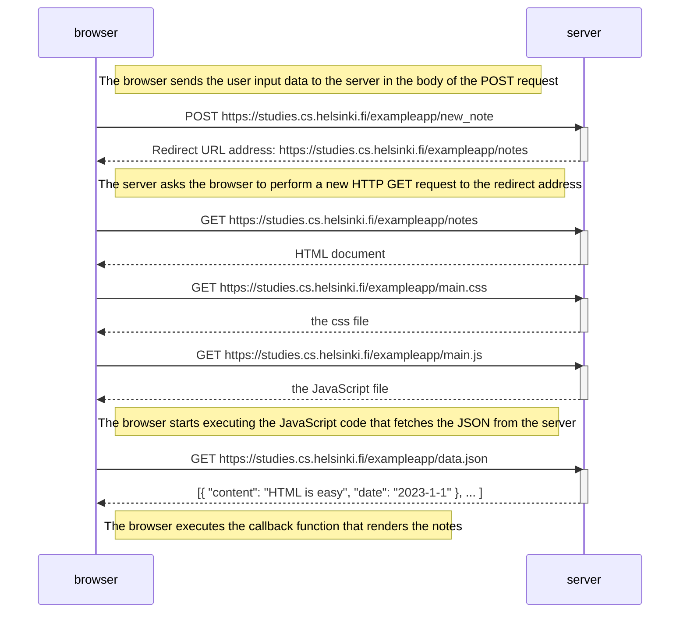

```mermaid
sequenceDiagram
    participant browser
    participant server

    Note right of browser: The browser sends the user input data to the server in the body of the POST request

    browser->>server: POST https://studies.cs.helsinki.fi/exampleapp/new_note
    activate server

    server-->>browser: Redirect URL address: https://studies.cs.helsinki.fi/exampleapp/notes
    deactivate server

    Note left of server: The server asks the browser to perform a new HTTP GET request to the redirect address

    browser->>server: GET https://studies.cs.helsinki.fi/exampleapp/notes
    activate server
    server-->>browser: HTML document
    deactivate server

    browser->>server: GET https://studies.cs.helsinki.fi/exampleapp/main.css
    activate server
    server-->>browser: the css file
    deactivate server

    browser->>server: GET https://studies.cs.helsinki.fi/exampleapp/main.js
    activate server
    server-->>browser: the JavaScript file
    deactivate server

    Note right of browser: The browser starts executing the JavaScript code that fetches the JSON from the server

    browser->>server: GET https://studies.cs.helsinki.fi/exampleapp/data.json
    activate server
    server-->>browser: [{ "content": "HTML is easy", "date": "2023-1-1" }, ... ]
    deactivate server

    Note right of browser: The browser executes the callback function that renders the notes
```
