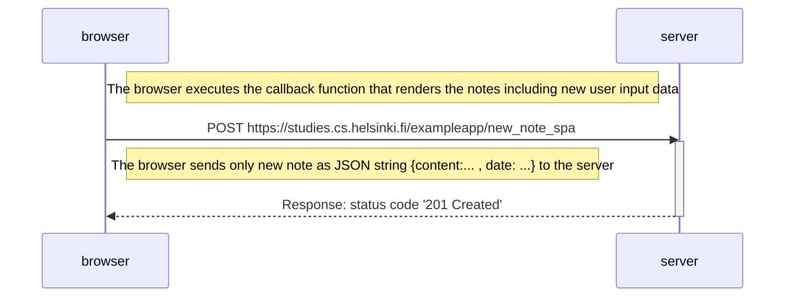

```mermaid
sequenceDiagram
    participant browser
    participant server

    Note right of browser: The browser executes the callback function that renders the notes including new user input data

    browser->>server: POST https://studies.cs.helsinki.fi/exampleapp/new_note_spa
    activate server

    Note right of browser: The browser sends only new note as JSON string {content:... , date: ...} to the server

    server-->>browser: Response: status code '201 Created'
    deactivate server
```